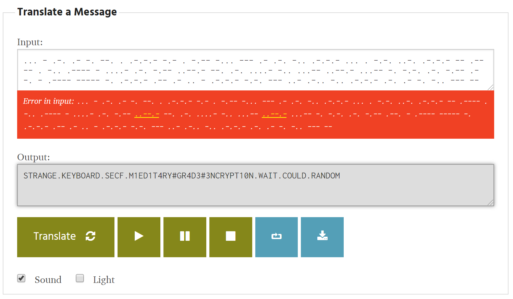
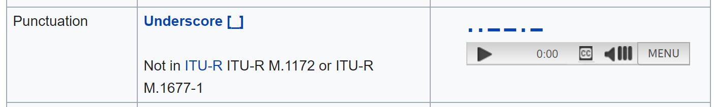
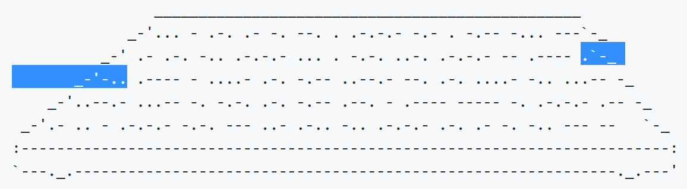

# Security Fest CTF 2019 "Signal"
Write-up by James Martindale

## Problem
> There is no signal, everything is silent.Nothing is impossible.  
> > Download: [signal.tar.gz](static/2019-securityfest-signal.tar.gz)

## Solution
This was, for the most part, a straightforward puzzle. I spent way more time trying to figure out the exact nature of the flag than finding the flag itself...and so did everyone else in #securityfest-ctf lol.

### The PDF

Extracting the contents of the archive yields a single file, `signal.pdf`. Inside is an ASCII art terminal thingy with **C:\> echo "Security Fest 2019"** displayed on a screen attached to a keyboard below.

```
             ____________________________________________________
            /                                                    \
           |    _____________________________________________     |
           |   |                                             |    |
           |   |  C:\> echo "Security Fest 2019"             |    |
           |   |                                             |    |
           |   |                                             |    |
           |   |                                             |    |
           |   |                                             |    |
           |   |                                             |    |
           |   |                                             |    |
           |   |                                             |    |
           |   |                                             |    |
           |   |                                             |    |
           |   |                                             |    |
           |   |                                             |    |
           |   |_____________________________________________|    |
           |                                                      |
            \_____________________________________________________/
                   \_______________________________________/
                ________________________________________________
             _-'... - .-. .- -. --. . .-.-.- -.- . -.-- -... ---`-_
          _-' .- .-. -.. .-.-.- ... . -.-. ..-. .-.-.- -- .---- .`-_
       _-'-.. .---- - ....- .-. -.-- ..--.- --. .-. ....- -.. ...-- -_
    _-'..--.- ...-- -. -.-. .-. -.-- .--. - .---- ----- -. .-.-.- .-- -_
 _-'.- .. - .-.-.- -.-. --- ..- .-.. -.. .-.-.- .-. .- -. -.. --- --   `-_
:-------------------------------------------------------------------------:
`---._.-------------------------------------------------------------._.---'
```

I'm sure there are methods of hiding data inside PDFs, but I didn't look them up yet. I was too busy admiring the lovely masterpiece in the PDF, since I am secretly jealous of all those who have the artistic talent to create such lovely works using nothing but simple characters. The detail in the keyboard itself is quite impressive, though I couldn't quite make out what those details were. Were they keyboard keys? Were they crumbs between the keys? No, it looked way too much like Morse code and not like little crumbs.

Oh hey, Morse code.

### The Morse Code
Sorry to disappoint you, but I don't know Morse code. Why bother learning it when the only time I'd ever use it is for a CTF? The top Google result for a Morse code translator was [Stephen Phillips' translator](https://morsecode.scphillips.com/translator.html), so I copied and pasted the keyboard not-crumbs into the tool and hit **Translate**.

I got back...something, but that big red box doesn't look so good:



### The Underscore
The tool replaces any sequences it doesn't recognize with a `#`. In this case we can see that `..--.-` corresponds to something between **M1ED1T4RY**, **GR4D3**, and **3NCRYPT10N**. If this was a flag that character would likely be an underscore, but I wanted to check just to be sure.

Wikipedia's article on [Morse code](https://en.wikipedia.org/wiki/Morse_code#Letters,_numbers,_punctuation,_prosigns_for_Morse_code_and_non-English_variants) has a table for punctuation, and the underscore pattern matches our mystery pattern above:


So now we have `STRANGE.KEYBOARD.SECF.M1ED1T4RY_GR4D3_3NCRYPT10N.WAIT.COULD.RANDOM`. The periods seem to be some stand-in for punctuation like spaces or curly braces or whatever, so we could lob off the ends and guess that the flag is `SECF{M1ED1T4RY_GR4D3_3NCRYPT10N}`.

Didn't work, though.

### The Trial and Error
I'm no expert in leetspeak, but I don't think "m1ed1t4ry" is a word.

From context it seems like some this should actually be "m1l1t4ry" instead, but once again I'm way too cautious and want to double-check.

Another look at Wikipedia's [Morse code chart](https://en.wikipedia.org/wiki/Morse_code#Letters,_numbers,_punctuation,_prosigns_for_Morse_code_and_non-English_variants) and we can see that E is `.`, D is `-..`, and L is `.-..`, or E and D stuck together. If you look very closely at the ASCII keyboard you can see that the code for L was split across two rows, and since I added a space between each row the L got treated as two letters instead of one.



So did `SECF{M1L1T4RY_GR4D3_3NCRYPT10N}` work? lolnope, the challenge writer accidentally used `secf` in all of their challenges instead of `sctf`.

So did `SCTF{M1L1T4RY_GR4D3_3NCRYPT10N}` work? lolnope, flags were only accepted in lowercase.

So did `sctf{m1l1t4ry_gr4d3_3ncrypt10n}` work? Yes, finally.
